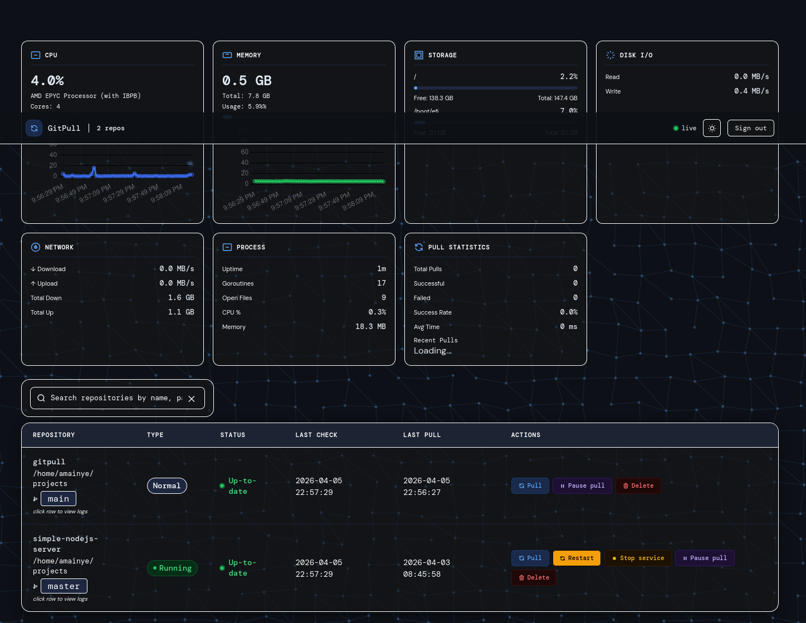
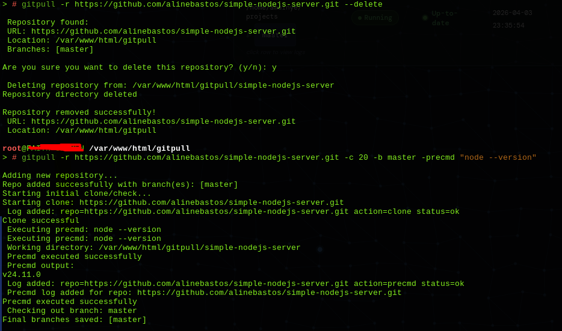
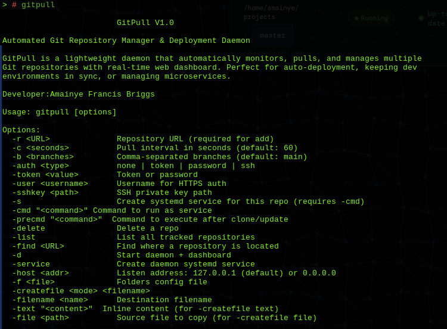

# GitPull v1.0

**Automated Git Repository Manager & Deployment Daemon**


GitPull is a lightweight daemon that automatically monitors, pulls, and manages multiple Git repositories with a real-time web dashboard. Perfect for auto-deployment, keeping dev environments in sync, or managing microservices.

## Features

- **Auto Pull & Clone** - Automatically clones new repos and pulls updates every 30 seconds
- **Web Dashboard** - Real-time monitoring with live updates, logs, and one-click controls
- **PAM Authentication** - System-level auth with session management and rate limiting
- **Service Management** - Auto-create systemd services, restart services on updates
- **Multi-Branch Support** - Track multiple branches per repository simultaneously
- **Git Authentication** - Token, password, or SSH key authentication support
- **Pre-Commands** - Run custom scripts before or after git operations
- **Auto File Creation** - Create or copy files into repositories automatically
- **Pause/Resume** - Temporarily suspend monitoring for any repository
- **Smart Retries** - Exponential backoff for network failures (up to 5 retries)
- **Modern UI** - Dark/light theme, responsive design, real-time SSE updates
- **Multi-Folder Support** - Monitor repositories across different directories

## Quick Start

### Installation

```bash
# Clone and build
git clone https://github.com/yourusername/gitpull.git
cd gitpull
sudo chmod +x gitpull

# Or install directly
sudo cp gitpull /usr/local/bin/ # Run gitpull as system wide global command

sudo ./gitpull -d # Run gitpull as a non system-wide global command

##  First initialization

gitpull --service # create the gitpull as a service and start the gitpull service on port :8445
#or create a git -r respository clone and gitpull ask you if you want to run gitpull as a service 
```



```bash
##	Basic usage

# Add a repository with default settings (main branch, 60s interval)
gitpull -r https://github.com/user/repo.git

# Add with specific branch
gitpull -r https://github.com/user/repo.git -b develop

# Add with multiple branches
gitpull -r https://github.com/user/repo.git -b main,develop,staging,feature-x

# Add with custom pull interval (120 seconds)
gitpull -r https://github.com/user/repo.git -c 120

# Add repository in specific directory (run from that directory)
cd /var/www/
gitpull -r https://github.com/user/webapp.git

# Add multiple repositories in different folders
cd /home/user/projects
gitpull -r https://github.com/user/backend.git

cd /var/services  
gitpull -r https://github.com/user/api-gateway.git

##	Authentication Usage

# HTTPS with GitHub Personal Access Token
gitpull -r https://github.com/user/private-repo.git -auth token -token ghp_xxxxxxxxxxxx

# HTTPS with username and password
gitpull -r https://gitlab.com/user/repo.git -auth password -user myusername -token mypassword

# SSH with default key (~/.ssh/id_rsa)
gitpull -r git@github.com:user/repo.git

# SSH with custom private key
gitpull -r git@github.com:user/repo.git -auth ssh -sshkey /home/user/.ssh/deploy-key

# SSH with custom key and specific branch
gitpull -r git@github.com:user/repo.git -auth ssh -sshkey /etc/ssh/repo-key -b production

##	Service Management

# Add repository with systemd service (auto-start on boot, auto-restart on failure)
gitpull -r https://github.com/user/node-app.git -s -cmd "node server.js"

# Add with service and custom interval
gitpull -r https://github.com/user/python-app.git -s -cmd "python app.py" -c 30

# Add Go service with build step
gitpull -r https://github.com/user/golang-api.git -s -cmd "./api-server" -precmd "go build -o api-server"

# Add Docker service
gitpull -r https://github.com/user/docker-app.git -s -cmd "docker-compose up -d"

# Add systemd service for a specific branch
gitpull -r https://github.com/user/app.git -b production -s -cmd "/usr/bin/myapp --prod"

# Update existing repo to add service
gitpull -r https://github.com/user/app.git -s -cmd "node server.js"


##	File Creation

# Run build command after pull
gitpull -r https://github.com/user/app.git -precmd "make build"

# Run multiple commands
gitpull -r https://github.com/user/app.git -precmd "npm install && npm run build"

# Run with service restart
gitpull -r https://github.com/user/app.git -precmd "systemctl restart myapp"

# Run database migrations after pull
gitpull -r https://github.com/user/app.git -precmd "python manage.py migrate"

# Run tests after update (optional, can fail without stopping)
gitpull -r https://github.com/user/app.git -precmd "go test ./... || true"

# Combine pre-cmd with service management
gitpull -r https://github.com/user/webapp.git -s -cmd "gunicorn app:app" -precmd "pip install -r requirements.txt"


##	Repository Management

# List all monitored repositories (via dashboard)
# Just open http://localhost:8445

# Delete a repository (removes files and service)
gitpull -r https://github.com/user/repo.git -delete

# List all respository

gitpull -list # List all respository

gitpull -find https://github.com/user/repo.git #find a respository

```



```bash

##	Daemon Management- Daemon can be used if Gitpull is not running as a systemd service 

# Start daemon in foreground (for testing)
sudo gitpull -d

# Start daemon on specific network interface (local only - default)
sudo gitpull -d -host 127.0.0.1

# Start daemon accessible from network (all interfaces)
sudo gitpull -d -host 0.0.0.0

# Start daemon with custom folders config
sudo gitpull -d -f /etc/myconfig/folders.txt

# Create systemd service (interactive)
sudo gitpull -service

# Remove systemd service and config (interactive)
sudo gitpull -service

# Check service status
sudo systemctl status gitpull-daemon

# Restart daemon
sudo systemctl restart gitpull-daemon

# View daemon logs
sudo journalctl -u gitpull-daemon -f

# Stop daemon
sudo systemctl stop gitpull-daemon
  
  
##	Docker Microservices Stack
# Service 1: API Gateway
cd /opt/services
gitpull -r https://github.com/company/gateway.git -s -cmd "docker-compose up -d gateway"

# Service 2: Auth Service  
gitpull -r https://github.com/company/auth.git -s -cmd "docker-compose up -d auth"

# Service 3: Worker Service
gitpull -r https://github.com/company/worker.git -s -cmd "docker-compose up -d worker"

##	Static Website with Nginx
# Pull static site and reload nginx
cd /var/www/html
gitpull -r https://github.com/company/website.git -b main -precmd "chown -R www-data:www-data . && systemctl reload nginx"

#	Auto-Deploy Node.js Application
# Add repository with auto-restart

cd /var/www
gitpull -r https://github.com/company/webapp.git -b production -s -cmd "node server.js" -precmd "npm install && npm run build" -createfile text -filename .env -text "NODE_ENV=production\nPORT=3000"
  
#CI/CD Pipeline Integration
# Build and test on pull
gitpull -r https://github.com/company/app.git -precmd "make test && make build && systemctl restart app" -createfile text -filename .version -text "v1.0.0"
```

